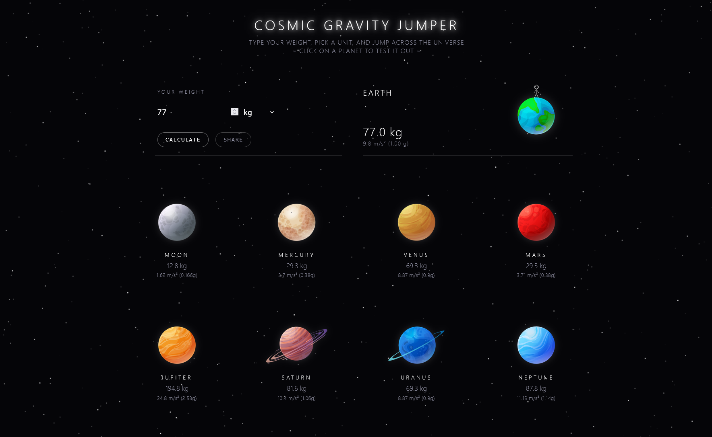
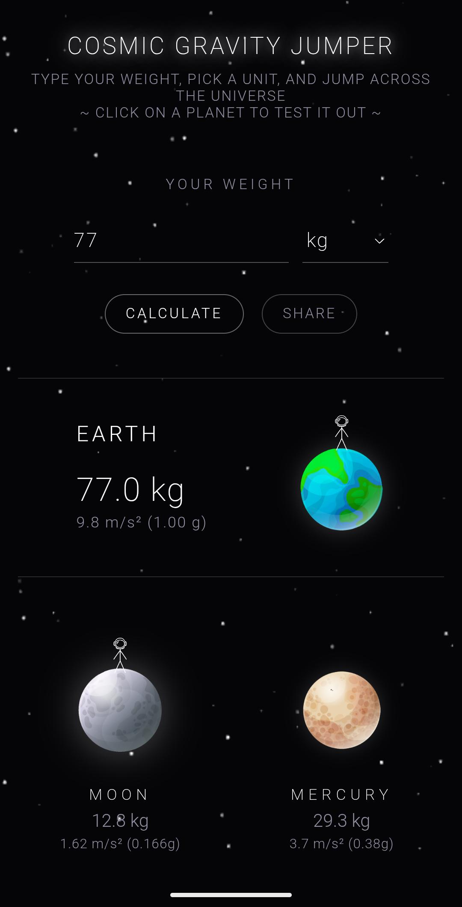
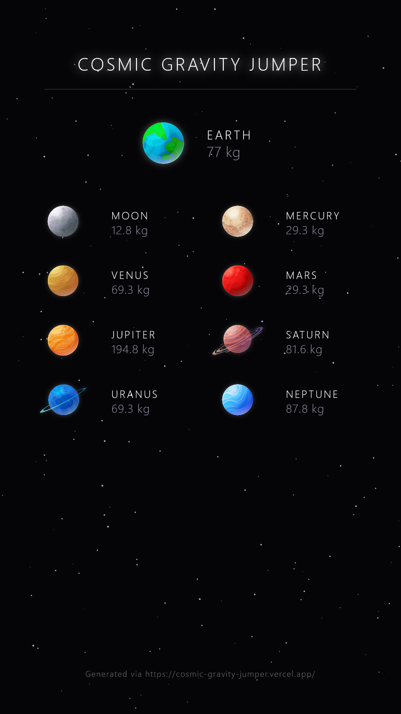

# 🚀 Cosmic Gravity Jumper

> Calculate your cosmic weight across the solar system, simulate gravity jumps, and generate instant shareable posters!



## 🌐 Live Demo
Play with the app live here: **[https://cosmic-gravity-jumper.vercel.app](https://cosmic-gravity-jumper.vercel.app)**

---

## 🌌 Overview
**Cosmic Gravity Jumper** is an interactive space-physics web app built for **Hack Club Stardance**. Users can input their Earth weight to calculate real-time weight conversions across 8 celestial bodies and the Moon, interact with custom jumping animations influenced by planetary surface gravity, and download high-resolution 9:16 graphics for social media.

---

<table align="center">
  <tr>
    <td align="center"><b>Mobile UI</b></td>
    <td align="center"><b>Generated 9:16 Poster</b></td>
  </tr>
  <tr>
    <td align="center"></td>
    <td align="center"></td>
  </tr>
</table>

---

## ✨ Key Features
- 🪐 **Celestial Gravity Engine**: Real-time relative mass and gravity calculations ($g$-force ratios for Moon, Mercury, Venus, Mars, Jupiter, Saturn, Uranus, Neptune).
- 👩‍🚀 **Physics Jump Simulator**: Interactive jumping astronaut animations with custom pitch-swept Web Audio API sound effects.
- 🎨 **Dynamic 9:16 Poster Generator**: Generates shareable, downloadable high-resolution posters using HTML5 Canvas layout calculations.
- 🌌 **Interactive Starfield Background**: Dynamic twinkling particle system with mouse proximity illumination.
- 📱 **Mobile-Optimized Experience**: Responsive touch interactions and design layout.
- ⚡ **Zero-Dependency Architecture**: Built completely with vanilla HTML5, CSS3, and JavaScript (<50KB footprint).

---

## 🛠️ Built With
- **HTML5 & CSS3** (Flexbox, CSS Grid, and custom CSS variables)
- **Vanilla JavaScript (ES6+)**
- **HTML5 Canvas API** (Starfield background & poster export)
- **Web Audio API** (Procedural sound synthesis)

---

## 🚀 Running Locally

If you would like to run or inspect the code locally:

1. Clone the repository:
   ```bash
   git clone https://github.com/sadman137/cosmic-weight-calculator.git
   ```
2. Navigate into the project folder:
   ```bash
   cd cosmic-weight-calculator
   ```
3. Open `index.html` directly in your browser or run via VS Code **Live Server**.

---

## 👨‍💻 Author
Built with 💖 for **Hack Club Stardance** by **SADMAN**.
