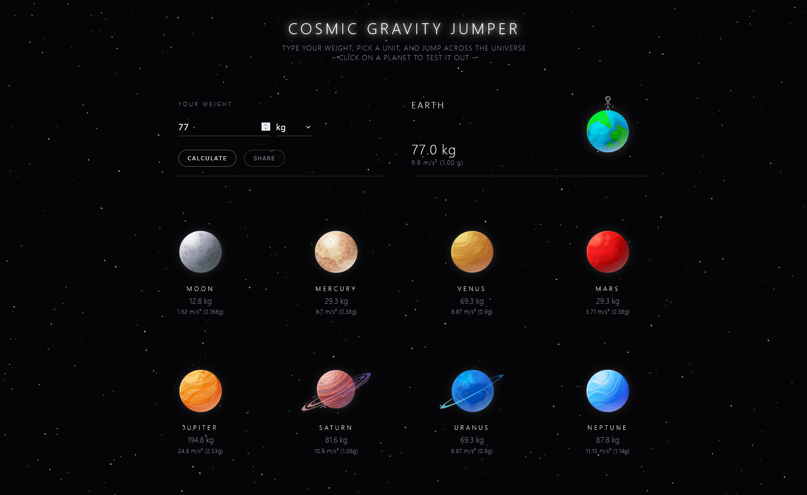
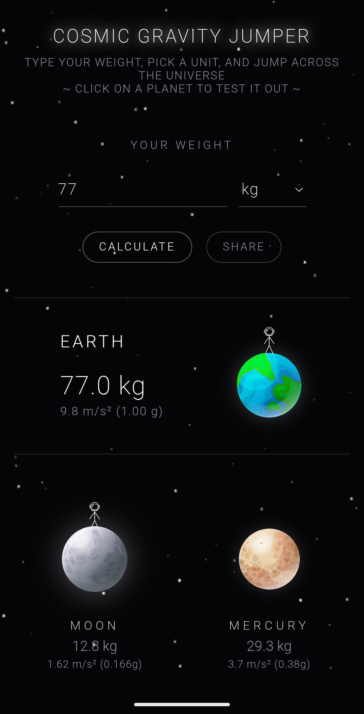
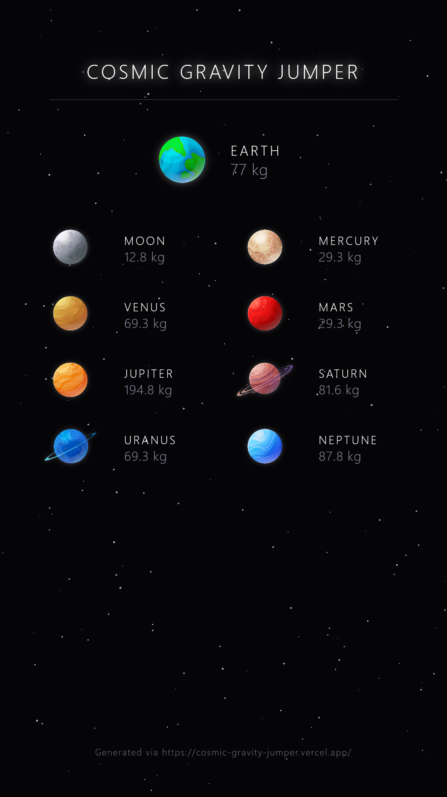

# Cosmic Gravity Jumper

Jump around the universe on different planets and bodies to calculate your weight there and generate instant shareable posters for your instagram story!



## Live Demo
Test it out here: **[https://cosmic-gravity-jumper.vercel.app](https://cosmic-gravity-jumper.vercel.app)**

## Overview
**Cosmic Gravity Jumper** is an interactive space-physics web app built for **Hack Club Stardance**.
Put in your Earth weight (the one you measure on a weight machine), hit calculate and it instantly calculates what you'd weigh across 8 planets, the moon and more to come! See how high you'd jump on the celestial bodies compared to earth by just clicking on them! Hit the share button to get an instant 9:16 poster ready to drop on social media.

<table align="center">
  <tr>
    <td align="center"><b>Mobile UI</b></td>
    <td align="center"><b>Generated 9:16 Poster</b></td>
  </tr>
  <tr>
    <td align="center"></td>
    <td align="center"></td>
  </tr>
</table>

## Key Features
- **Real Space Physics**: Real-time weight & g-force math calculations.
- **Gravity Jump Simulator**: Tap/click on a planet to watch your astronaut float or slam back down depending on its gravity.
- **Sound Effects**: Custom pitched Web Audio sound effects when jumping.
- **Poster Generator**: Generates high-res 9:16 images built right in the browser with HTML5 Canvas.
- **Interactive Stars Background**: Move your cursor around to make the background stars twinkle.
- **Mobile-Optimized Experience**: Responsive touch interactions and design layout.
- **No Framework**: Built with vanilla HTML5, CSS3, and JavaScript (under 50KB total).

## Built With
- **HTML5 & CSS3** (Flexbox, CSS Grid, and custom CSS variables)
- **Vanilla JavaScript (ES6+)**
- **HTML5 Canvas API** (Starfield background & poster render)
- **Web Audio API** (Synthesized sound effects)

## Running Locally
If you would like to run or inspect the code locally:

1. Clone the repository:
   ```bash
   git clone https://github.com/sadman137/cosmic-weight-calculator.git
   ```
2. Navigate into the project folder:
   ```bash
   cd cosmic-weight-calculator
   ```
3. Open `index.html` directly in your browser or run via VS Code **Live Server**.

## How It Works
**1. Sound**
Every sound is made in the browser with the Web Audio API. An oscillator's pitch slides up or down with an exponential ramp, a gain node fades it out. The pitch is dependant on the planets gravity, so jumping on Jupiter sounds different from jumping on the Moon.

**2. Share Poster**
When you hit the share button, it draws a poster on a hidden canvas and downloads it as a 9:16 PNG. I had to write my own text wrapping since canvas doesn't do it for you. Scaled everything by the device pixel ratio so it doesn't come out blurry or sharper screens.

**3. Jump Physics**
Gravity changes the vertical speed and speed changes the height, frame by frame. Used the real surface gravity for each planet. Tied updates to the time between frames inside `requestAnimationFrame` to prevent stutter.

## Credits
Free planet assets by [macrovector](https://www.magnific.com/free-vector/sun-moon-mercury-venus-earth-mars-jupiter-saturn-uranus-neptun-colorful-planets-set_13768792.htm#fromView=search&page=1&position=3&uuid=5fe6b382-2e03-4730-b15c-57bcc2d7efed&track=ais_hybrid&query=planets+solar+system) in [Magnific](https://www.magnific.com)

## Author
Built with 💖 for **Hack Club Stardance** by **SADMAN**.
